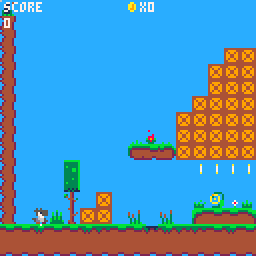

# Retro Pico Platformer

A project to create, polish and publish a #pico8 #platformer game made to mimic the feel of the nes era games.  

**[Project Table](https://github.com/Achie72/retro_pico_platformer/projects/1)**  
**[Lates Blog about Project](https://github.com/Achie72/retro_pico_platformer/discussions/9)**

# Like my work?

If you do consider supporting me a price of a coffee over at my Ko-fi page. Caffein makes code appear faster!    

# Follow my work

Other social sites:  
☕ [Ko-fi](https://ko-fi.com/achiegamedev)  
🐦 [Twitter](https://twitter.com/Achie7240)  
📷 [Instagram](https://www.instagram.com/justanerdlife/)  
🎥 [Twitch](https://www.twitch.tv/achie7240)  
🎬 [YouTube](https://www.youtube.com/channel/UCzWXrvo-Pj7_KDv4w4q-4Kg)  

Games platforms (more coming):    
🎮 [Itch.io](https://achie.itch.io/)  
🕹️ [Newgrounds](https://achie72.newgrounds.com/)  

All my links in one place:  
🌳 [Linktr.ee](https://linktr.ee/AchieGameDev)  

